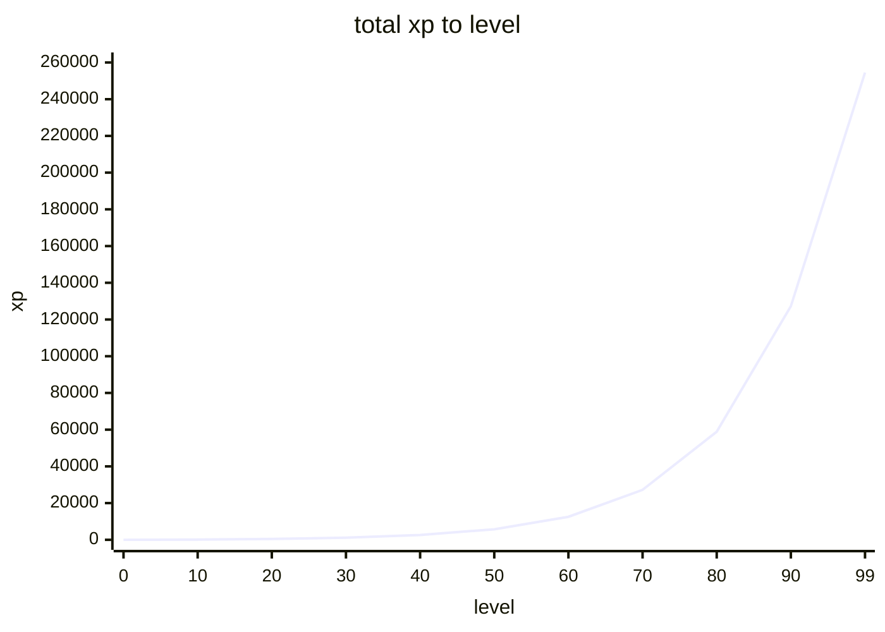

# xp curve

- runescape-like exponential curve
- each level costs 8% more than the previous one

## references
[Sara Jensen Schubert RPG Maths](https://www.youtube.com/watch?v=7f2JPryyqPs)
[Experience @ Old School RuneScape Wiki](https://oldschool.runescape.wiki/w/Experience)

## formulas
- `B = 10` (`LEVEL_BASE_XP`), `G = 1.08` (`LEVEL_GROWTH`)

```rust
let xp_for_step = |level: f64| 10.0 * 1.08_f64.powf(level);
let xp_to_reach = |level: f64| 125.0 * (1.08_f64.powf(level) - 1.0);
let level = |xp: f64| ((1.0 + xp / 125.0).ln() / 1.08_f64.ln()).floor().min(99.0);
```

`xp_to_reach(10.0) = 145`, `level(145.0) = 10`

## numbers
training = 120 xp/h

| level | xp | training |
|---|---|---|
| 10 | 145 | 1.2 h |
| 50 | 5,738 | 48 h |
| 92 | 148,433 | 1,237 h |
| 99 | 254,477 | 2,121 h |


